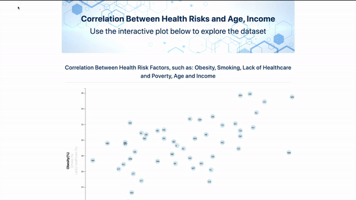
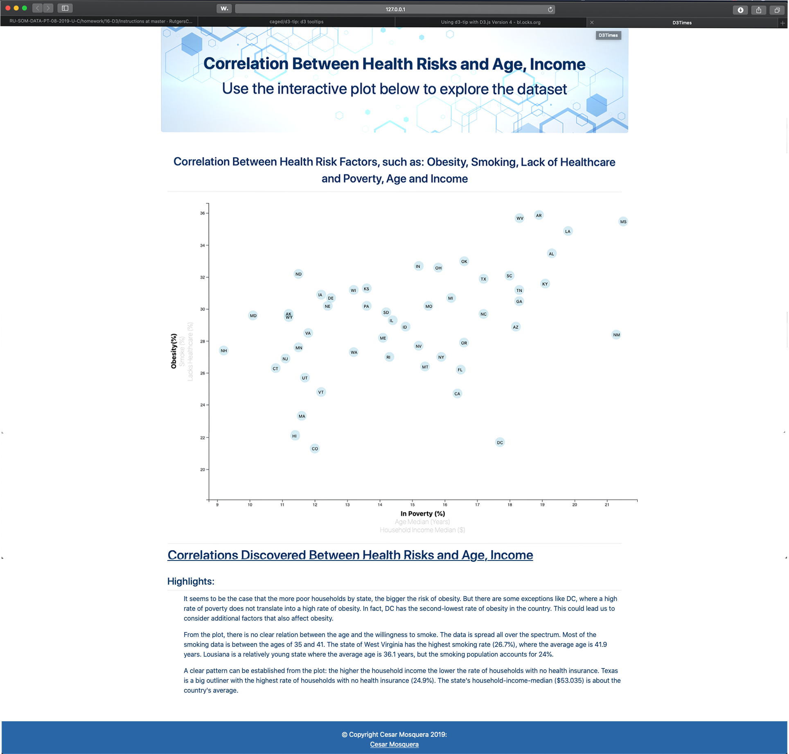

# Correlation Between Health Risk Factors and Demographics

## Project Description
The goal of the project is to use the `Javascript-D3` library to create multiple and interactive scatterplots using `HTML`, `CSS`, `Bootstrap`, and `Javascript`. 
- All the project files are contained in this repo.

### App Running 

### Sample app Screenshot

 

## Instructions

#### Steps
1. - Run a python -m http.server or any other server for this purpose.
2. - Load the `index.html` file.

# File Description
### - index.html
- Contains the html code that drive the plots and references the requiered libraries
### - Assets
- Contains the `css` file with the formatting information
- Contains the `csv` file with the data used to plot
- Contains the `js` with the `Javascript` code using the D3 library for the interactive plots.
### - Screenshots
- Contains the `gif` and `png` files with screenshots of the app running
